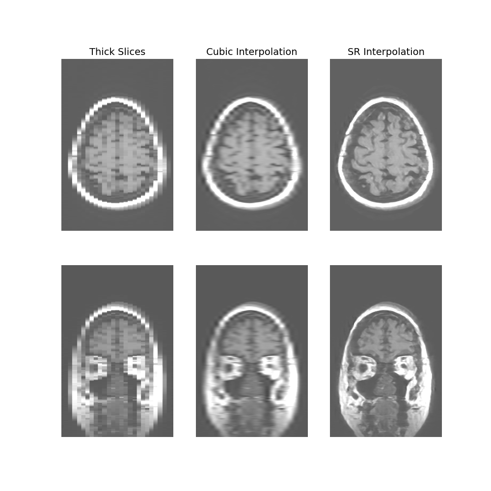
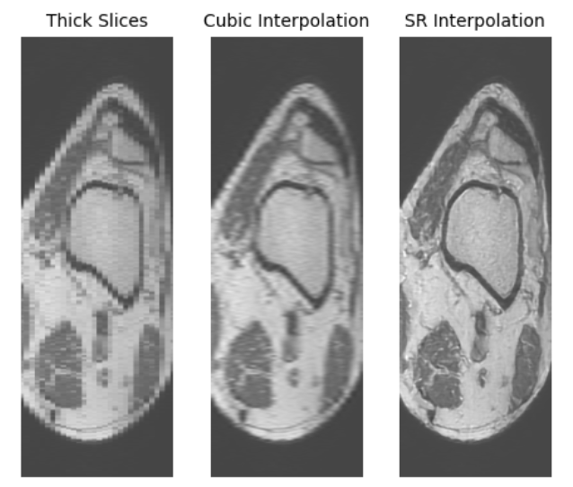
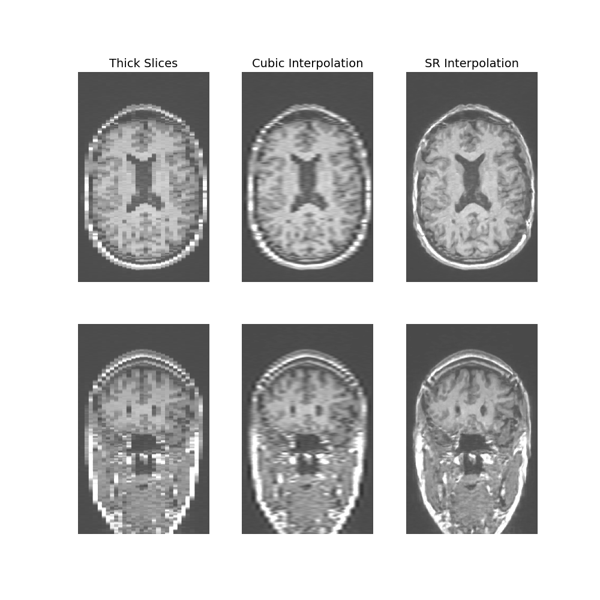
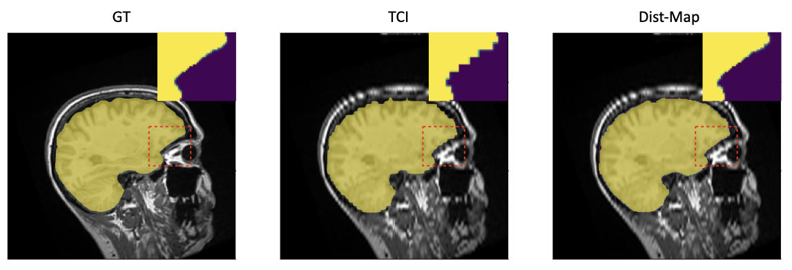

## SOUP-GAN: 

Super-resolution interpolation tool for medical images.

This inference code supports: 

1) Thick-slices to thin-slices SR interpolation with arbitrarily user-selected sampling ratios (e.g., from 2x to 6x). 
2) Medical imaging mask inerpolation.

#
[SOUP-GAN: Super-Resolution MRI Using Generative Adversarial Networks](https://arxiv.org/abs/2106.02599)

[Kuan Zhang](https://www.mayo.edu/research/labs/radiology-informatics/faculty-staff), Haoji Hu, [Kenneth Philbrick](https://www.linkedin.com/in/kenneth-philbrick-1b164bb), [Gian Marco Conte](https://www.mayo.edu/research/labs/radiology-informatics/faculty-staff), [Joseph D. Sobek](https://www.mayo.edu/research/labs/radiology-informatics/faculty-staff), [Pouria Rouzrokh](https://www.mayo.edu/research/labs/radiology-informatics/faculty-staff), [Bradley J. Erickson](https://www.mayo.edu/research/faculty/erickson-bradley-j-m-d-ph-d/bio-00077505)
#
#### Usage:

Install the package [KevinSR](https://pypi.org/project/KevinSR/). 

>`from KevinSR import mask_interpolation, SOUP_GAN`

>`# for SR image interp (prep_type=0: thick-to-thin; 1: thin-to-thin)`

>`thin_slices = SOUP_GAN(thick_slices, factor, prep_type)`

>`# for mask interp` 

>`new_masks = mask_interpolation(masks, factor)`

#### Example:
Example_0 (thick_to_thin):

Example_1 (sparse_to_thin):

Mask_interpolation:

